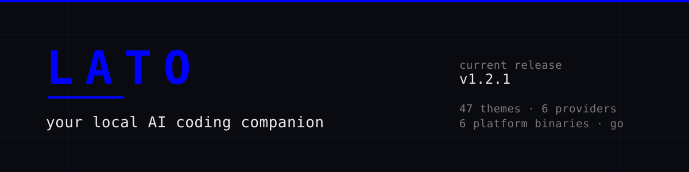
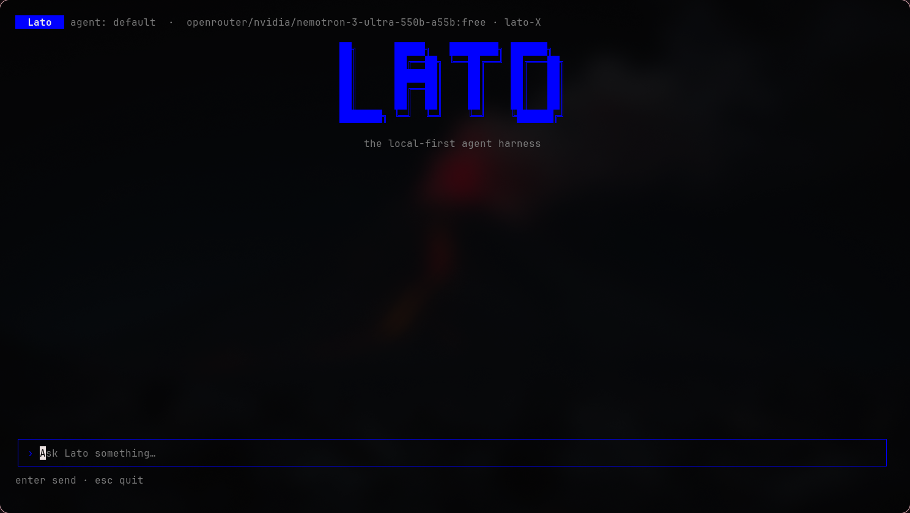
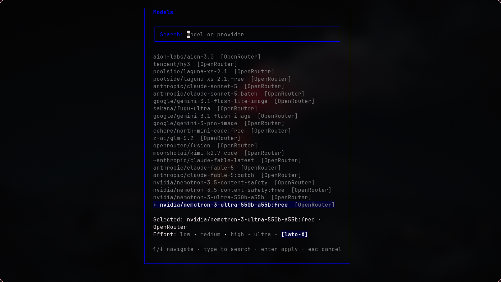
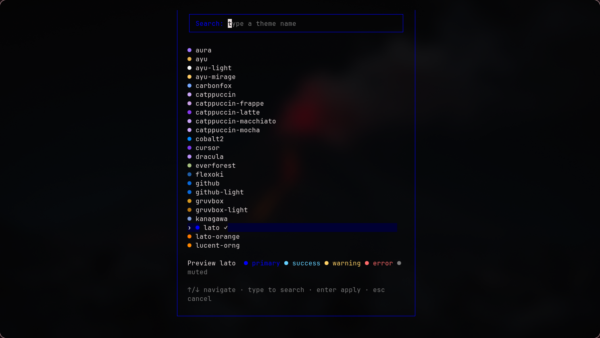

<div align="center">



<p><strong>Your Local AI Coding Companion.</strong></p>

<p>A terminal-native AI coding assistant built in Go — one binary, local configuration, and model access you choose yourself.</p>

<p>
<a href="https://github.com/lazyarjun2005-rgb/lato/releases/tag/v1.2.1"></a>
<a href="https://github.com/lazyarjun2005-rgb/lato"></a>
<a href="https://github.com/lazyarjun2005-rgb/lato/blob/master/LICENSE"></a>
<a href="https://github.com/lazyarjun2005-rgb/lato/releases/tag/v1.2.1"></a>
</p>

</div>

---

## Contents

<table>
<tr>
<td align="center" width="25%"><a href="#quick-installation"><b>Install</b></a><br><sub>one command</sub></td>
<td align="center" width="25%"><a href="#screenshots"><b>Screenshots</b></a><br><sub>see it run</sub></td>
<td align="center" width="25%"><a href="#features"><b>Features</b></a><br><sub>what it does</sub></td>
<td align="center" width="25%"><a href="#whats-new-in-v121"><b>v1.2.1</b></a><br><sub>what changed</sub></td>
</tr>
<tr>
<td align="center"><a href="#quick-start"><b>Quick Start</b></a><br><sub>first session</sub></td>
<td align="center"><a href="#command-reference"><b>Commands</b></a><br><sub>full reference</sub></td>
<td align="center"><a href="#themes"><b>Themes</b></a><br><sub>47 palettes</sub></td>
<td align="center"><a href="#models-and-providers"><b>Providers</b></a><br><sub>models and keys</sub></td>
</tr>
<tr>
<td align="center"><a href="#configuration"><b>Configuration</b></a><br><sub>config.yaml</sub></td>
<td align="center"><a href="#platform-support"><b>Platforms</b></a><br><sub>six binaries</sub></td>
<td align="center"><a href="#version-history"><b>Releases</b></a><br><sub>version history</sub></td>
<td align="center"><a href="#documentation"><b>Docs</b></a><br><sub>architecture</sub></td>
</tr>
</table>

---

## Quick Installation

Lato ships as a single prebuilt binary. The installers detect your platform,
download the matching release asset, verify its SHA-256 checksum against the
release's `checksums.txt`, and install it per user. No Go toolchain, no `sudo`,
and no shell configuration edits.

**Linux / macOS**

```bash
curl -fsSL https://raw.githubusercontent.com/lazyarjun2005-rgb/lato/v1.2.1/scripts/install.sh | sh
```

**Windows (PowerShell)**

```powershell
irm https://raw.githubusercontent.com/lazyarjun2005-rgb/lato/v1.2.1/scripts/install.ps1 | iex
```

| Platform | Installed to |
| --- | --- |
| Linux / macOS | `~/.local/bin/lato` (override with `LATO_INSTALL_DIR`) |
| Windows | `%LOCALAPPDATA%\Programs\Lato\lato.exe` (user `PATH` updated automatically) |

If the install directory is not on your `PATH`, the installer prints the exact
line to add instead of editing your shell files.

**Verify the installation**

```bash
lato --version   # lato v1.2.1
lato doctor      # binary location, PATH, config, provider connections, workspace
```

<details>
<summary><b>npm and build-from-source</b></summary>

<br>

**npm (legacy)** — installs `v1.0.9`, not the current release. The wrapper
downloads the official release binary matching its own package version, so the
two always agree:

```bash
npm install -g lato-cli@1.0.9   # legacy: v1.0.9
```

The published `lato-cli` package is still on `1.0.9`. For **v1.2.1**, use the
shell or PowerShell installer above.

**Build from source** — requires Go 1.26 or later:

```bash
git clone https://github.com/lazyarjun2005-rgb/lato
cd lato
go build -o lato .
./lato
```

On Windows PowerShell:

```powershell
go build -o lato.exe .
.\lato.exe
```

To install into your Go bin directory instead: `go install .`

</details>

**Release:** [v1.2.1](https://github.com/lazyarjun2005-rgb/lato/releases/tag/v1.2.1) ·
[all releases](https://github.com/lazyarjun2005-rgb/lato/releases) ·
[release workflow run](https://github.com/lazyarjun2005-rgb/lato/actions/runs/37215463314)

---

## Screenshots

<p align="center">
<br>
<sub><b>Meet Lato</b> — your terminal-native AI coding companion, running in the project you launched it from.</sub>
</p>

<table>
<tr>
<td align="center" width="50%" valign="top">
<br><br>
<sub><b>Choose your model</b> — <code>/model</code> opens a searchable picker over the models discovered from your connected providers.</sub>
</td>
<td align="center" width="50%" valign="top">
<br><br>
<sub><b>Make it yours</b> — <code>/themes</code> previews a palette live and persists the one you confirm.</sub>
</td>
</tr>
</table>

---

## Why Lato?

Lato is a coding agent that lives in your terminal. It reads the project you
launched it in, streams replies as they arrive, runs real tools against real
files, and asks before anything destructive happens.

It is deliberately small and deliberately local-first:

- **One binary, no service.** No account, no backend to sign up for, no
  telemetry anywhere in the codebase.
- **Your files stay yours.** Sessions, configuration, memory, and tasks are
  written to your machine and read from your machine.
- **You choose the model.** Local models through Ollama or LM Studio work
  fully offline; hosted providers are contacted only after you switch to them
  and supply credentials.
- **It stays out of the way.** Native terminal text selection still works,
  dialogs clamp themselves to the window, and every action is reversible or
  permission-gated.

---

## Features

### AI workflow

| Capability | What it does |
| --- | --- |
| Streaming chat | Responses stream into a scrollable transcript with Markdown rendering and visible tool activity. |
| One-shot runs | `lato run "summarize the README"` runs a single prompt and prints the result. |
| Effort ladder | `low → medium → high → ultra → lato-X`, applied provider-aware and shown in the header. |
| Bounded execution | Tool calls, consecutive failures, provider retries, tool output, context size, and history turns are all capped by configurable limits. |
| Skills | Markdown skills are indexed at startup; only the catalog reaches the model, and bodies load on demand through `load_skill`. |
| Project memory | `remember`, `update`, `forget`, and `recall` facts that persist per project, managed through `/memory`. |
| Task continuity | Multi-step work is tracked, paused, and resumed with `/task resume`. |

### Provider and model management

| Capability | What it does |
| --- | --- |
| Six built-in providers | Ollama, LM Studio, NVIDIA NIM, OpenRouter, 9Router, OmniRoute — plus any custom OpenAI-compatible endpoint. |
| Live model discovery | The `/model` list is queried from the provider's live endpoint, so it shows what is actually served. |
| Grouped picker | The active provider's fresh list appears first, with cached lists from your other connected providers grouped beneath. |
| Custom model IDs | `/model add` registers a model ID by hand when a gateway does not advertise it; the ID is stored and sent verbatim. |
| Interactive connect | `/connect` walks through endpoint and masked API key entry, validates the connection, saves it, and opens the picker. |
| Config import | `/connect import` (or `/import`) reads existing OpenCode and Claude Code configurations and converts what is compatible. |
| Credential handling | Keys come from a saved `/connect` connection or the provider's environment variable — never bundled, never printed. |

### Terminal experience

| Capability | What it does |
| --- | --- |
| Bubble Tea TUI | Alternate-screen chat with a header showing agent, provider, model, and effort. |
| Slash palette | Typing `/` opens an autocomplete strip: `↑`/`↓` to choose, `Enter` to run, `Tab` to fill, `Esc` to dismiss. |
| Floating dialogs | Model, theme, provider, connect, session, and permission dialogs share one responsive geometry with clamped widths. |
| Clipboard | `/copy` for the latest response, `/copy transcript` for everything, `Alt+C` as a keyboard shortcut, with native helpers per platform. |
| Native selection | Mouse reporting stays off so your terminal's own text selection keeps working. |

### Themes and personalization

| Capability | What it does |
| --- | --- |
| 47 named palettes | Dark, light, and high-contrast palettes including `lato`, `lato-orange`, `catppuccin`, `gruvbox`, `nord`, `tokyonight`, and `system`. |
| Searchable picker | `/themes` filters by substring, previews the palette through the same styles the TUI uses, and persists on `Enter`. |
| Persisted preference | The chosen theme is saved to `config.yaml` and restored on the next launch. |
| Theme-aware rendering | Input prompt, placeholder, cursor, and Markdown rendering follow the active palette, including light themes. |

### Context and repository awareness

| Capability | What it does |
| --- | --- |
| Workspace discovery | Lato finds the project root from markers such as `.git`, `go.mod`, `package.json`, or `Cargo.toml`, and reads the language, module, and build system. |
| Repository index | A lazily built index of files, languages, and Go symbols backs `/index` and deterministic local search. |
| Grounded search tools | `search_repo` and `read_repo_file` return file paths and line references so answers come from real code. |
| Bounded retrieval | Excerpts pulled from the index are capped and evidence-backed, so code answers carry real file references. |

### Safety and execution controls

| Capability | What it does |
| --- | --- |
| Permission gate | Every tool action is classified first; destructive or out-of-workspace work pauses for approval. |
| Three decisions | Allow once, allow for the current task, or deny — with `esc`/`n` denying by default. |
| Sandboxed commands | `run_command` executes one program with arguments, without a shell, confined to the workspace, under a timeout with bounded output. |
| Local-only state | Config, sessions, memory, and tasks never leave the machine; the connection store holding keys is written `0600`. |

---

## What's New in v1.2.1

v1.2.1 is a UI-quality release: the three improvement phases that shaped the
model picker, theme picker, and every floating dialog, plus the canonical theme
identity.

<table>
<tr>
<td align="center" width="33%" valign="top">
<b>Polished dialogs</b><br><br>
<sub>Shared responsive modal geometry, clamped widths, correctly sized search fields, and consistent layouts across the model picker, theme picker, provider and connect dialogs, sessions, and permission prompts — including on narrow and short terminals. Existing keybindings and interaction semantics are unchanged.</sub>
</td>
<td align="center" width="33%" valign="top">
<b>Readable light themes</b><br><br>
<sub>Fixed light-theme input prompt, text, placeholder, and cursor styling, and made Markdown rendering follow the active palette. Chat text, search inputs, and dialogs stay legible on light backgrounds, and dark-theme behavior is preserved exactly as before.</sub>
</td>
<td align="center" width="33%" valign="top">
<b>A clearer identity</b><br><br>
<sub><code>lato</code> and <code>lato-orange</code> are now the canonical theme names, with the original electric-blue palette kept intact. <code>electric-blue</code> and <code>opencode</code> remain supported as configuration aliases, and the picker shows canonical names without duplicates.</sub>
</td>
</tr>
</table>

**[Read the v1.2.1 release notes →](https://github.com/lazyarjun2005-rgb/lato/releases/tag/v1.2.1)**
<sub>Compare: [v1.2.0…v1.2.1](https://github.com/lazyarjun2005-rgb/lato/compare/v1.2.0...v1.2.1) · release commit `430f523`</sub>

---

## Themes

The canonical Lato themes are:

| Theme | Role |
| --- | --- |
| `lato` | Default. The original electric-blue palette: `#0000FF` primary with a `#000033` selection surface. |
| `lato-orange` | Lato's warm alternative: `#FF7A00` primary. |

Two legacy names remain valid and are migrated automatically, so existing
`config.yaml` files keep working:

| Legacy alias | Resolves to |
| --- | --- |
| `electric-blue` | `lato` |
| `opencode` | `lato-orange` |

**Switching themes**

```text
/themes            open the searchable theme picker (preview live, Enter to persist)
```

Set the preference by hand in `config.yaml` instead:

```yaml
theme: lato
```

Names are case-insensitive, an unknown or missing value falls back to `lato`,
and `system` leaves the primary colors to your terminal's own defaults.

<details>
<summary><b>All 47 built-in palettes</b></summary>

<br>

`aura` · `ayu` · `ayu-light` · `ayu-mirage` · `carbonfox` · `catppuccin` ·
`catppuccin-frappe` · `catppuccin-latte` · `catppuccin-macchiato` ·
`catppuccin-mocha` · `cobalt2` · `cursor` · `dracula` · `everforest` · `flexoki` ·
`github` · `github-light` · `gruvbox` · `gruvbox-light` · `kanagawa` · `lato` ·
`lato-orange` · `lucent-orng` · `material` · `matrix` · `mercury` · `monokai` ·
`nightowl` · `nord` · `nord-light` · `one-dark` · `orng` · `osaka-jade` ·
`palenight` · `rosepine` · `rosepine-dawn` · `rosepine-moon` · `solarized` ·
`solarized-light` · `synthwave84` · `system` · `tokyonight` · `tokyonight-light` ·
`tokyonight-storm` · `vercel` · `vesper` · `zenburn`

The picker navigates with `↑`/`↓` (plus `Home`/`End`, `PageUp`/`PageDown`),
previews the highlighted palette through the same semantic styles the chat uses,
and persists only on `Enter`. `Esc` restores the theme that was active when the
picker opened — search text and previews are never written to disk.

</details>

---

## Models and Providers

| Provider | ID | Default endpoint | API key |
| --- | --- | --- | --- |
| Ollama | `ollama` | `http://localhost:11434` | none — local |
| LM Studio | `lmstudio` | `http://localhost:1234/v1` | none — local |
| NVIDIA NIM | `nvidia` | `https://integrate.api.nvidia.com/v1` | `NVIDIA_API_KEY` |
| OpenRouter | `openrouter` | `https://openrouter.ai/api/v1` | `OPENROUTER_API_KEY` |
| 9Router | `9router` | `http://localhost:20128/v1` | `NINEROUTER_KEY` |
| OmniRoute | `omniroute` | `http://localhost:8787/v1` (override in config) | `OMNIROUTE_KEY` |
| Custom | your own slug | anything OpenAI-compatible | optional |

Lato implements exactly two wire protocols: a native Ollama client and a shared
OpenAI-compatible Chat Completions client. Adding an OpenAI-shaped provider means
adding one registry entry — no runtime or TUI changes.

**How model selection behaves**

```text
/model               open the searchable picker for the active provider
/model <id>          switch directly
/model add           register a model ID by hand
/model refresh       re-run discovery for every connected provider
/provider <id>       switch provider, then pick a model
/connect [import]    connect a provider, or import an existing configuration
```

- The active provider's list is fetched live; other connected providers appear
  below from their cached discovery.
- Model IDs are opaque strings. Lato never splits, normalizes, or rewrites them.
- Switching provider opens the model picker, so you never end up on a stale model.
- A hosted provider with neither a saved connection nor an environment key is
  refused up front with instructions to run `/connect`.

**Credential precedence**

1. A saved `/connect` configuration (including imports)
2. The provider's environment variable
3. `config.yaml` `model.endpoint` and registry defaults

**A note on OpenCode and Claude Code.** These are *import sources*, not
providers. `/connect import` reads an existing `opencode.json` /
`opencode.jsonc` and converts providers built on the OpenAI or
`@ai-sdk/openai-compatible` shape; it reads Claude Code's `ANTHROPIC_BASE_URL` /
`ANTHROPIC_AUTH_TOKEN` only when the endpoint clearly points at an
OpenAI-compatible gateway. Native Anthropic endpoints are not supported and are
refused with an explanation. Detection only reads files — nothing executes and
nothing is saved until you confirm.

---

## Quick Start

**1. Install Lato**

```bash
curl -fsSL https://raw.githubusercontent.com/lazyarjun2005-rgb/lato/v1.2.1/scripts/install.sh | sh
```

**2. Run a local model (optional, for a fully offline setup)**

```bash
ollama serve
ollama pull ornith:9b
```

**3. Launch Lato inside a project**

```bash
cd ~/Projects/my-project
lato
```

`lato` with no subcommand opens the interactive chat; the current directory is
the workspace. `lato chat` starts the same session explicitly, and
`lato --resume <session-id>` reopens a saved one.

**4. Configure a provider and model**

The first run writes a default `config.yaml` pointing at Ollama. From inside
Lato, connect or switch interactively:

```text
/provider            open the provider picker
/model               open the searchable model picker
/connect             add a provider with a masked API key
```

**5. Start working**

```text
› explain this repository
› /search where sessions are persisted
› /fix the failing test in internal/session
```

Run `/help` at any time for the full command list, or `/status` for a summary of
the project and agent setup.

---

## Command Reference

### Session and model

| Command | Description |
| --- | --- |
| `/model [id \| add \| refresh]` | Show or switch the model; register custom IDs; refresh discovery. |
| `/provider [id]` | Show or switch the provider, then pick a model. |
| `/connect [import]` | Connect a provider interactively, or import existing configurations. |
| `/import` | Import provider connections from OpenCode or Claude Code configs. |
| `/effort [level]` | Show or switch effort: `low`, `medium`, `high`, `ultra`, `lato-x`. |
| `/fast` | Drop this session to low effort, without touching config. |

### Session control

| Command | Description |
| --- | --- |
| `/sessions` (alias `/s`) | Open the saved session picker. |
| `/resume <target>` | Resume a session by ID, unique ID prefix, or exact title. |
| `/rename <title>` | Give the current session a persistent title. |
| `/rewind [n]` | Drop the last *n* conversation turns. |
| `/branch [title]` | Copy this conversation into an independent session and switch to it. |
| `/export [path]` | Export the conversation as Markdown, never overwriting an existing file. |
| `/copy [response \| transcript]` | Copy the last response, or the whole transcript, to the clipboard. |
| `/clear` | Clear the conversation. |
| `/exit` | End the session. |

### Project state

| Command | Description |
| --- | --- |
| `/memory [add TEXT \| remove ID \| clear]` | Inspect and manage persistent project memory. |
| `/task [resume [id] \| abandon <id>]` | List tasks, resume paused work, or retire a task. |
| `/skills` | List the skills the agent can load. |
| `/permissions [reset]` | Show the permission policy; clear temporary approvals. |
| `/workspace` | Describe the current repository. |
| `/index` | Show the repository index summary. |
| `/status` | Summarize the current project and agent setup. |
| `/themes` | Open the searchable theme picker. |

### Diagnostics

| Command | Description |
| --- | --- |
| `/doctor` | Environment check: binary, PATH, config, connections, workspace. |
| `/version` | Print the running Lato version. |
| `/help` | List available commands. |

<details>
<summary><b>Development prompts</b></summary>

<br>

Each of these builds a grounded instruction and sends it through the same agent
loop as a normal prompt — they inherit the tool system, the permission gate,
and the effort profile.

| Command | Usage | What it does |
| --- | --- | --- |
| `/search` | `/search <topic>` | Search the repository and report paths with line references. |
| `/explain` | `/explain <target>` | Explain a file, symbol, or concept from real source. |
| `/debug` | `/debug <symptom>` | Trace a problem to its root cause with evidence. |
| `/fix` | `/fix <problem>` | Diagnose, fix, and verify with the project's build or tests. |
| `/test` | `/test [target]` | Run tests and diagnose failures honestly. |
| `/build` | `/build [target]` | Build the project and report diagnostics. |
| `/run` | `/run [what]` | Run something in the workspace and explain the result. |
| `/review` | `/review [target]` | Advisory code review of a target or the working tree. |
| `/refactor` | `/refactor <goal>` | Restructure code without changing behavior. |
| `/code` | `/code <task>` | Implement a task end to end with verification. |

</details>

### CLI

| Command | Description |
| --- | --- |
| `lato` | Open the interactive chat in the current directory. |
| `lato chat` | Same session, started explicitly. |
| `lato run <task>` | Run a one-shot prompt and print the response. |
| `lato doctor` | Report installation, configuration, and environment. |
| `lato --resume <id>` | Resume a saved session. |
| `lato --version` | Print the version (`lato v1.2.1`). |

### Agent tools

The tools available to the model, by category:

| Category | Tools |
| --- | --- |
| Files | `read_file`, `write_file`, `create_file`, `edit_file`, `list_files` |
| Repository | `search_repo`, `read_repo_file` |
| Execution | `run_command`, `pwd` |
| Skills | `load_skill` |
| Memory | `remember_project_fact`, `update_project_memory`, `forget_project_memory`, `recall_project_memory` |

---

## Configuration

Lato writes its configuration on first run and never rewrites it behind your
back.

| Platform | Location |
| --- | --- |
| Linux | `~/.config/lato/` |
| macOS | `~/Library/Application Support/lato/` |
| Windows | `%AppData%\Lato\` |

| File or variable | Purpose |
| --- | --- |
| `config.yaml` | Active provider, endpoint, model, agent prompt, limits, theme. |
| `providers.json` | Connections saved by `/connect`, including keys. Written `0600`. |
| `skills/` | Markdown skills, with optional YAML frontmatter. |
| `memory/` | Per-project memory, keyed by a hash of the workspace path. |
| `tasks/` | Per-project task state, keyed the same way. |
| `LATO_HOME` | Overrides the whole configuration directory. |

Chat transcripts live next to the project instead, in `<workspace>/.lato/sessions/`,
so they travel with the repository you were working in and stay out of your
user-level configuration.

<details>
<summary><b>config.yaml example</b></summary>

<br>

```yaml
model:
  provider: ollama
  endpoint: http://localhost:11434
  name: llama3
  # effort: high      # low | medium | high | ultra | lato-x

agent:
  name: default
  system_prompt: |
    You are a helpful coding assistant.

limits:
  max_tool_calls: 100               # hard cap on tool executions per run
  max_consecutive_failures: 5       # stop after this many consecutive failures
  provider_retries: 3               # extra attempts for transient failures
  max_tool_output: 65536            # bytes per tool result
  context_budget: 131072            # bytes of history per model turn
  max_history_turns: 20             # user turns of history per model turn

theme: lato
```

Every `limits` value is optional. A missing, zero, or negative value selects the
safe default, so a hand-edited file can never silently mean "unlimited".

</details>

**Environment variables**

| Variable | Used for |
| --- | --- |
| `OPENROUTER_API_KEY`, `NVIDIA_API_KEY`, `NINEROUTER_KEY`, `OMNIROUTE_KEY` | Hosted provider credentials. |
| `LATO_HOME` | Configuration directory override. |

**Key handling.** Lato bundles no credentials. Keys are read from the
environment or from a `/connect` connection, never written to `config.yaml`,
never printed, and redacted as `***` in transcripts, errors, and import previews.
`providers.json` holds saved keys in plain text but is written with `0600`
permissions inside a `0700` directory — treat it as a secret file.

---

## Platform Support

Every release publishes six binaries plus a `checksums.txt`.

| Platform | Architecture | Asset |
| --- | --- | --- |
| Linux | amd64 | `lato-linux-amd64` |
| Linux | arm64 | `lato-linux-arm64` |
| macOS | amd64 | `lato-darwin-amd64` |
| macOS | arm64 | `lato-darwin-arm64` |
| Windows | amd64 | `lato-windows-amd64.exe` |
| Windows | arm64 | `lato-windows-arm64.exe` |

**[Download v1.2.1 →](https://github.com/lazyarjun2005-rgb/lato/releases/tag/v1.2.1)**

<details>
<summary><b>Manual download and checksum verification</b></summary>

<br>

```bash
curl -fLO https://github.com/lazyarjun2005-rgb/lato/releases/download/v1.2.1/lato-linux-amd64
curl -fLO https://github.com/lazyarjun2005-rgb/lato/releases/download/v1.2.1/checksums.txt
sha256sum -c checksums.txt --ignore-missing
chmod +x lato-linux-amd64 && mv lato-linux-amd64 ~/.local/bin/lato
```

The published `lato-linux-amd64` SHA-256 for v1.2.1 is:

```text
0857c79f6af88a23acd46fc3c2be0826fe7f85b4a12c06e4a90734ab8f5be6c2
```

The shell and PowerShell installers already perform this verification for you.

</details>

---

## Version History

### v1.2.1

- Polished floating picker and dialog layouts: shared responsive geometry,
  clamped widths, and complete search/input borders.
- Improved `/model`, `/themes`, `/connect`, custom-provider, session,
  provider, and permission dialog layouts, including narrow and short terminals.
- Corrected light-theme input prompt, text, placeholder, and cursor contrast,
  and made Markdown rendering follow the active palette.
- Established the canonical `lato` and `lato-orange` themes, keeping
  `electric-blue` and `opencode` as compatibility aliases.
- Retained the v1.2.0 model discovery, provider configuration, clipboard, and
  native terminal selection behavior.

### v1.2.0

- Multi-theme palette engine and an interactive theme picker.
- Searchable model picker with per-provider grouping.
- Cross-platform clipboard handling (`pbcopy`, `xclip`/`xsel`/`wl-copy`, `clip.exe`).
- UX integration across pickers, dialogs, and the input surface.

### v1.1.0

- Adopted the electric-blue theme identity.
- Hardened repository awareness and bounded conversation history.
- Bounded tool output and context growth, plus improved agent loop control and
  cancellation timeouts.
- Security and persistence foundation: closed sensitive access bypasses and
  hardened tool-call validation.

### v1.0.9

- Previous stable baseline, published as `lato-cli@1.0.9` on npm.

<sub>[Compare releases](https://github.com/lazyarjun2005-rgb/lato/releases) ·
[release notes source](docs/ReleaseNotes-v1.2.1.md)</sub>

---

## Documentation

Architecture and package reference live in [`docs/`](docs/Index.md):

| Guide | Covers |
| --- | --- |
| [Getting Started](docs/GettingStarted.md) | Install, first run, first session. |
| [Runtime](docs/Runtime.md) | The agent loop, limits, and streaming. |
| [Providers](docs/Providers.md) | Wire protocols, registry, discovery, credentials. |
| [Tools](docs/Tools.md) | Tool framework and built-in implementations. |
| [TUI](docs/TUI.md) | Interface parts, pickers, themes, keybindings. |
| [Command](docs/Command.md) | Slash command parsing and dispatch. |
| [Session](docs/Session.md) | History, persistence, branching. |
| [Config](docs/Config.md) | `config.yaml`, limits, connections. |
| [Repository](docs/Repository.md) | Indexing and deterministic search. |
| [Effort](docs/Effort.md) | The effort ladder and what each level changes. |
| [Index](docs/Index.md) | Full documentation index. |

---

## Contributing

Lato is a small Go codebase with a short direct dependency list. There is no
`CONTRIBUTING.md` yet, so here is the practical bar:

```bash
go build ./...   # must succeed
go test ./...    # must pass
go vet ./...     # must be clean
```

CI runs those three checks on every pull request across Linux, macOS, and
Windows, and CodeQL analyses the repository. Tagged pushes (`v*`) run the same
checks, build all six platform binaries, generate `checksums.txt`, and publish
the GitHub release.

Design rules the codebase holds to — please keep them in mind before opening a
large pull request:

- Keep the runtime small and packages separate; each owns one responsibility.
- Providers stream one model turn and never execute tools or own sessions.
- Tools stay deterministic, focused, and free of hidden side effects.
- Sessions and configuration stay local and backward compatible.
- The TUI is presentation only — no runtime logic in the UI.
- Configuration is user-editable and never silently rewritten.

Issues and pull requests are welcome on [GitHub](https://github.com/lazyarjun2005-rgb/lato).

---

## License

Lato is released under the [Apache License 2.0](LICENSE) (SPDX: `Apache-2.0`).

```text
Copyright 2026 Jehoshua M
```

---

<div align="center">

<sub>

**[lato](https://github.com/lazyarjun2005-rgb/lato)** ·
[Releases](https://github.com/lazyarjun2005-rgb/lato/releases) ·
[Issues](https://github.com/lazyarjun2005-rgb/lato/issues) ·
[Documentation](docs/Index.md) ·
[Apache-2.0](LICENSE)

Current release: **v1.2.1** — terminal-native, local-first, written in Go.

</sub>

</div>